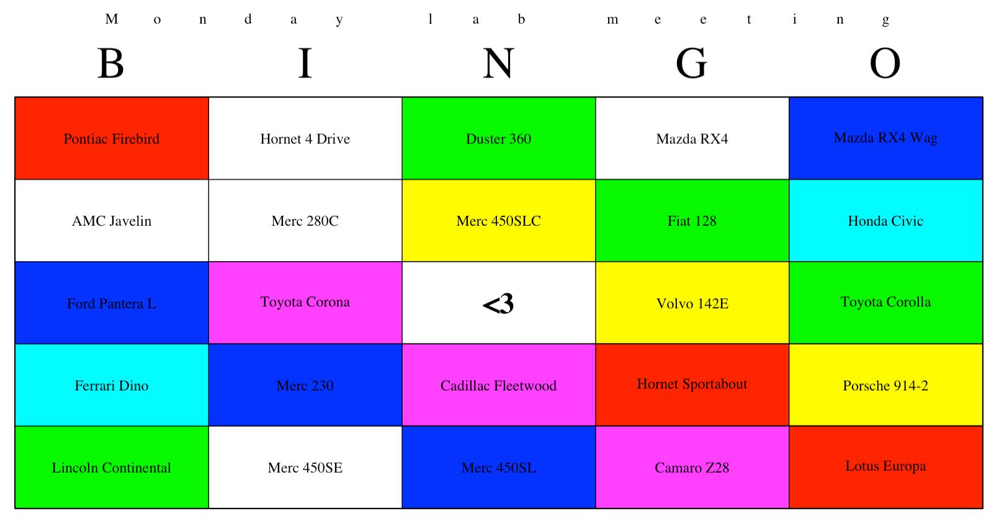

ccbingo
====

conference call bingo

to install:

```r
# install.packages('devtools')
devtools::install_github('raredd/ccbingo')
```

---

### play locally

**with built-in cards**

```r
library('ccbingo')
head(cards$zoom, 5)
```

```
## [1] "___, are you there?"            "*animal noises*"                                   "*child noises*"
## [4] "*loud, painful echo/feedback*"  "*sound of someone typing, possibly with a hammer*"
```

**start an interactive game**

```r
ccbingo(cards$zoom)
```


**customize with new cards, aesthetics, rules**

```r
ccbingo(
  rownames(mtcars), wins = function(x) if (sum(x) >= 6) '6 or more' else '',
  title = 'Monday lab meeting', free = '<3',
  col.grid = rainbow(6), col.free = 'white', col.select = 'white'
)
```



```
## You win!
##
## --> 6 or more
##
## Fake an injury and end the call
```

### shiny app

```r
ccbingo_app()
```


---

### source


